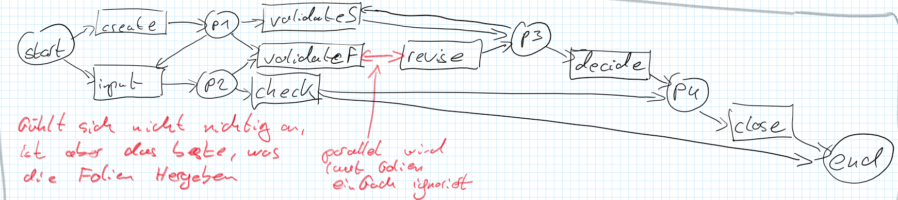
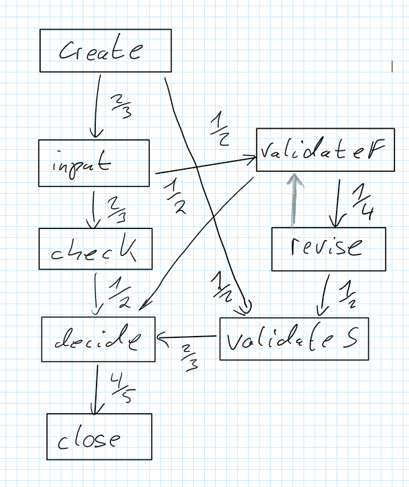

# Aufgabe 1

Ich habe die Daten zuerst in ein Code notebook geladen und damit analysiert.

Letztendlich habe dadurch die Folgenden 3 Kernattribute heraus analysiert:
 * **CaseID**: transaction_id. (Sie ist aber scheinbar manchmal mit der customer_id vertauscht)
 * **Timestamp**: Es interessiert uns ein Zeitpunkt. In diesen Fällen wird üblicherweise der Start Zeitpunkt verwendet
 * **Activity**: Sie setzt sich aus dem ```action_type``` und dem ```status_code``` zusammen. (Wichtig sind hier actions die vershieden status_codes haben können)

## Aktivitäten
Dadurch habe ich die folgenden vorhandenen Aktivitäten erhalten:
 * create (entry created)
 * input (data input)
 * validateS (validation successful)
 * check 
 * decide
 * validateF (validation failed)
 * revise
 * close


## xes
Daraus ergibt sich die Folgende xes Tabelle (generiert mit dem Notebook):

```
1,CREATE_ENTRY_SUCCESS,2025-01-01 09:00:00
2,DATA_INPUT_SUCCESS,2025-01-01 09:15:00
1,VALIDATE_DATA_SUCCESS,2025-01-01 09:25:00
3,CREATE_ENTRY_SUCCESS,2025-01-01 09:30:00
2,CHECK_RULES_SUCCESS,2025-01-01 09:40:00
1,DECIDE_ACTION_SUCCESS,2025-01-01 09:50:00
4,CREATE_ENTRY_SUCCESS,2025-01-01 10:00:00
3,VALIDATE_DATA_FAILED,2025-01-01 10:15:00
3,REVISE_ENTRY_SUCCESS,2025-01-01 10:40:00
1,CLOSE_CASE_SUCCESS,2025-01-01 10:50:00
4,DATA_INPUT_SUCCESS,2025-01-01 11:00:00
3,VALIDATE_DATA_SUCCESS,2025-01-01 11:10:00
4,CHECK_RULES_SUCCESS,2025-01-01 11:15:00
3,DECIDE_ACTION_SUCCESS,2025-01-01 11:25:00
4,DECIDE_ACTION_SUCCESS,2025-01-01 11:30:00
3,CLOSE_CASE_SUCCESS,2025-01-01 11:55:00
4,CLOSE_CASE_SUCCESS,2025-01-01 12:00:00
5,CREATE_ENTRY_SUCCESS,2025-01-01 12:10:00
5,DATA_INPUT_SUCCESS,2025-01-01 12:20:00
5,VALIDATE_DATA_FAILED,2025-01-01 12:30:00
5,REVISE_ENTRY_SUCCESS,2025-01-01 12:40:00
5,VALIDATE_DATA_FAILED,2025-01-01 12:50:00
5,REVISE_ENTRY_SUCCESS,2025-01-01 13:00:00
5,DECIDE_ACTION_SUCCESS,2025-01-01 13:10:00
5,CLOSE_CASE_SUCCESS,2025-01-01 13:30:00
```
*(In diesem Fall nach datum sortiert)*


# Alpha Algorithmus

## Matrix

|           | create | input | validateS | check | decide | validateF | revise | close |
| --------- | ------ | ----- | --------- | ----- | ------ | --------- | ------ | ----- |
| create    | #      | ->    | ->        | #     | #      | ->        | #      | #     |
| input     | <-     | #     | #         | ->    | #      | ->        | #      | #     |
| validateS | <-     | #     | #         | #     | ->     | #         | <-     | #     |
| check     | #      | <-    | #         | #     | ->     | #         | #      | #     |
| decide    | #      | #     | <-        | <-    | #      | #         | <-     | ->    |
| validateF | <-     | <-    | #         | #     | #      | #         | <->    | #     |
| revise    | #      | #     | ->        | #     | ->     | <->       | #      | #     |
| close     | #      | #     | #         | #     | <-     | #         | #      | #     |

## Edges
  edges ({action} followed by {action})*
* ({create}, {input})
* ({create}, {validateS})
* ({create}, {validateF})
* ({input}, {check})
* ({input}, {validateF})
* ({validateS}, {decide})
* ({check}, {close})
* ({decide}, {close})
* ({revise}, {validateS})
* ({revise}, {decide})

## Kombinierte Edges
*Dies ist eher geraten, weder die Folien eine vernünftige Erklärung noch ein verständliches Beispiel enthält*

**Start:**
+ ({create}, {input, validateS, validateF}) -> p1
+ ({input}, {check, validateF}) -> p2

**??**
+ ({validateS}, {decide}) -> p3
+ ({revise}, {validateS, decide}) -> p6
  
+ ({create, revise}, {validateS}) -> p7
+ ({validateS, revised}, {decide}) -> p9
  
**End:**
+ ({input}, {check}) -> p10
+ ({check, decide}, {close}) -> p11

## Petri-Netz



# Heuristisches Mining

## Häufigkeitsmatrix
|           | create | input | validateS | check | decide | validateF | revise | close |
| --------- | ------ | ----- | --------- | ----- | ------ | --------- | ------ | ----- |
| create    |        | 2     | 1         |       |        | 1         |        |       |
| input     |        |       |           | 2     |        | 1         |        |       |
| validateS |        |       |           |       | 2      |           |        |       |
| check     |        |       |           |       | 1      |           |        |       |
| decide    |        |       |           |       |        |           |        | 4     |
| validateF |        |       |           |       | 1      |           | 2      |       |
| revise    |        |       | 1         |       | 1      | 1         |        |       |
| close     |        |       |           |       |        |           |        |       |


|           | create | input | validateS | check | decide | validateF | revise | close |
| --------- | ------ | ----- | --------- | ----- | ------ | --------- | ------ | ----- |
| create    |        | 2/3   | 1/2       |       |        | 1/2       |        |       |
| input     | -2/3   |       |           | 2/3   |        | 1/2       |        |       |
| validateS | -1/2   |       |           |       | 2/3    |           | -1/2   |       |
| check     |        | -2/3  |           |       | 1/2    |           |        |       |
| decide    |        |       | -2/3      | -1/2  |        | -1/2      | -1/2   | 4/5   |
| validateF | -1/2   | -1/2  |           |       | 1/2    |           | 1/4    |       |
| revise    |        |       | 1/2       |       | 1/2    | -1/4      |        |       |
| close     |        |       |           |       | -4/5   |           |        |       |

