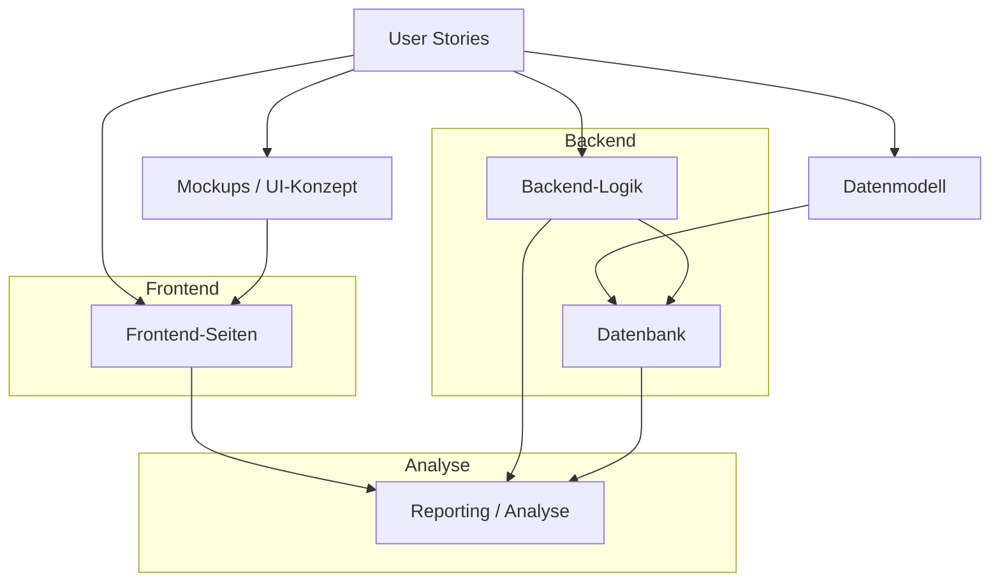
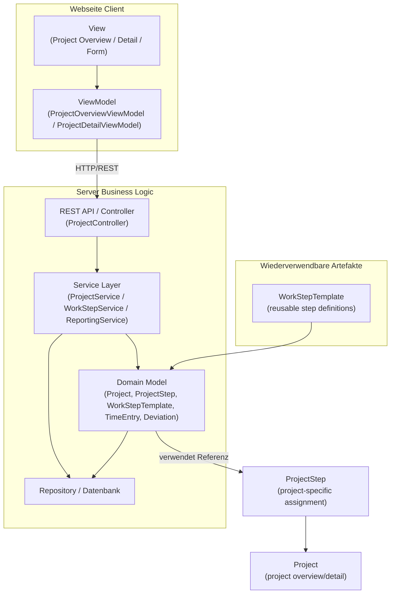

# Artefaktdiagramm

Dieses Artefaktdiagramm fasst die zentralen Artefakte des Projekts aus Praktikum 02 zusammen und orientiert sich an den User Stories aus `userstories.md`.

## 1. Ziel

Ziel des Diagramms ist es, die wichtigsten Entwicklungs- und Produktartefakte sowie ihre Beziehungen zu visualisieren. Grundlage sind die User Stories für:

- Startseite anzeigen
- Projektübersicht anzeigen
- Projektseite anzeigen
- Neues Projekt anlegen
- Planung definieren
- Arbeitsaufwand automatisch berechnen
- Arbeitschritte verwalten
- Abweichungen analysieren

## 2. Hauptartefakte

- `User Stories` (Anforderungen)
- `Mockups / UI-Konzept` (Benutzeroberfläche)
- `Datenmodell` (Projekt, Arbeitsschritte, Zeitdaten)
- `Frontend-Seiten` (Startseite, Projektübersicht, Projektdetailseite, Formularseite)
- `Backend-Logik` (Projektverwaltung, Zeitberechnung, Auswertung)
- `Datenbank` (Persistenz)
- `Reporting / Analyse` (Abweichungen, Gesamtkalkulation)

## 3. Beziehungen zwischen Artefakten

- Die `User Stories` definieren, welche Funktionalitäten das System bereitstellen muss.
- Aus den User Stories entstehen `Mockups / UI-Konzept` und das `Datenmodell`.
- `Frontend-Seiten` werden aus dem UI-Konzept abgeleitet und setzen die Anforderungen um.
- `Backend-Logik` implementiert die Geschäftsregeln wie Projektanlage, Planung, Aufwandsermittlung und Abweichungsanalyse.
- Das `Datenmodell` wird in der `Datenbank` persistiert.
- `Reporting / Analyse` nutzt Daten aus `Frontend-Seiten`, `Backend-Logik` und `Datenbank`.

## 4. Diagramm

## 5. Erläuterung

- `User Stories` sind das Kernartefakt der Anforderungsdefinition.
- `Mockups / UI-Konzept` zeigen die Struktur der Startseite, Projektübersicht, Projektseite und Formularseiten.
- `Datenmodell` enthält Entitäten wie Projekt, Arbeitsschritte, geschätzte und tatsächliche Zeit.
- `Frontend-Seiten` liefern die konkrete Benutzeroberfläche für den Zugriff auf Projektinformationen.
- `Backend-Logik` sorgt für das Anlegen neuer Projekte, die Planung von Arbeitsschritten, die Aufwandsermittlung und die Analyse von Abweichungen.
- `Datenbank` speichert projektbezogene Daten dauerhaft.
- `Reporting / Analyse` ist das Ergebnis zur Auswertung des Gesamtaufwands und zur Erkennung von Planabweichungen.

## 6. Architekturdiagramm: Client / Server mit Model, View, ViewModel

Die Projektübersicht und Projektdetails werden als Webseite im Client dargestellt. Der Browser enthält die Views und das ViewModel, während der Server die Business-Logic und das persistente Datenmodell bereitstellt.

### 6.1 Architekturkomponenten

- `View`:
  - Projektübersicht
  - Projektdetailseite
  - Formularseiten für Projektanlage und Arbeitsschritte
- `ViewModel`:
  - `ProjectOverviewViewModel`
  - `ProjectDetailViewModel`
  - Bindet UI-Daten an Nutzerinteraktionen und ruft API-Endpunkte auf
- `Server / Business Logic`:
  - `ProjectController` / REST-API
  - `ProjectService`, `WorkStepService`, `ReportingService`
  - Berechnet Aufwand, erstellt Projekte und liefert Projektdetails
- `Model`:
  - Domain-Entitäten: `Project`, `WorkStepTemplate`, `ProjectStep`, `TimeEntry`, `Deviation`
  - `WorkStepTemplate` ist wiederverwendbar und nicht direkt ins Projektmodell eingebettet
- `Persistence`:
  - `Repository` / `Datenbank`
  - Speichert Projekte, Arbeitsschritte, Zuordnungen und Zeitdaten

### 6.2 Besonderheiten des Projektmodells

- Ein `Project` besitzt Referenzen auf `ProjectStep`-Instanzen.
- `ProjectStep` verwendet `WorkStepTemplate` als Vorlage.
- `WorkStepTemplate` kann in verschiedenen Projekten wiederverwendet werden.
- Dadurch bleibt das Projektmodell schlank und die Arbeitsschritte sind keine festen Bestandteile des Projekts, sondern referenzierbare, wiederverwendbare Artefakte.

### 6.3 Architekturdiagramm

> Hinweis: `WorkStepTemplate` ist ein wiederverwendbares Artefakt, das von mehreren Projekten referenziert werden kann. `ProjectStep` ist die projektspezifische Zuordnung der Arbeitsschritte, die im Detail gezeigt wird.
